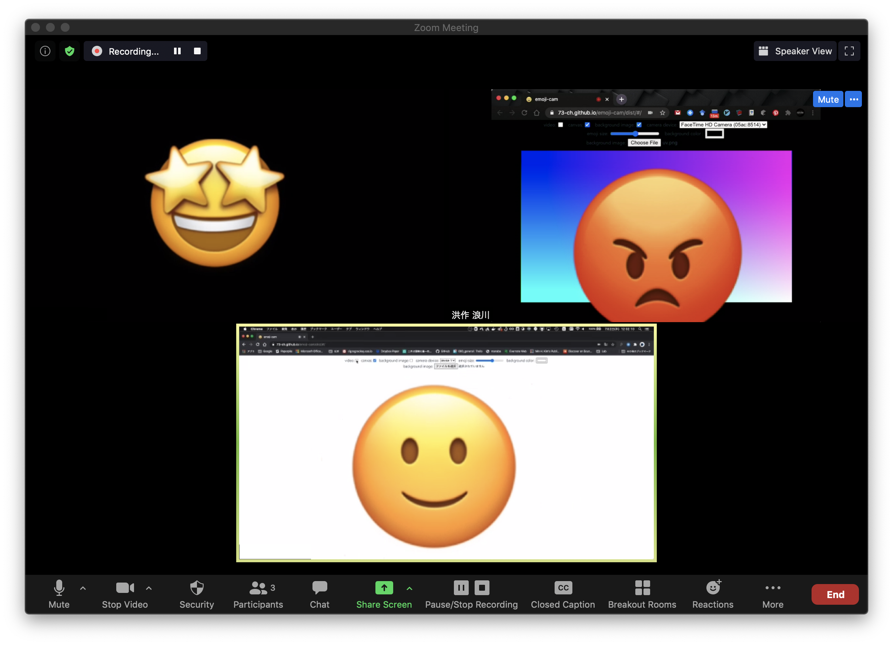
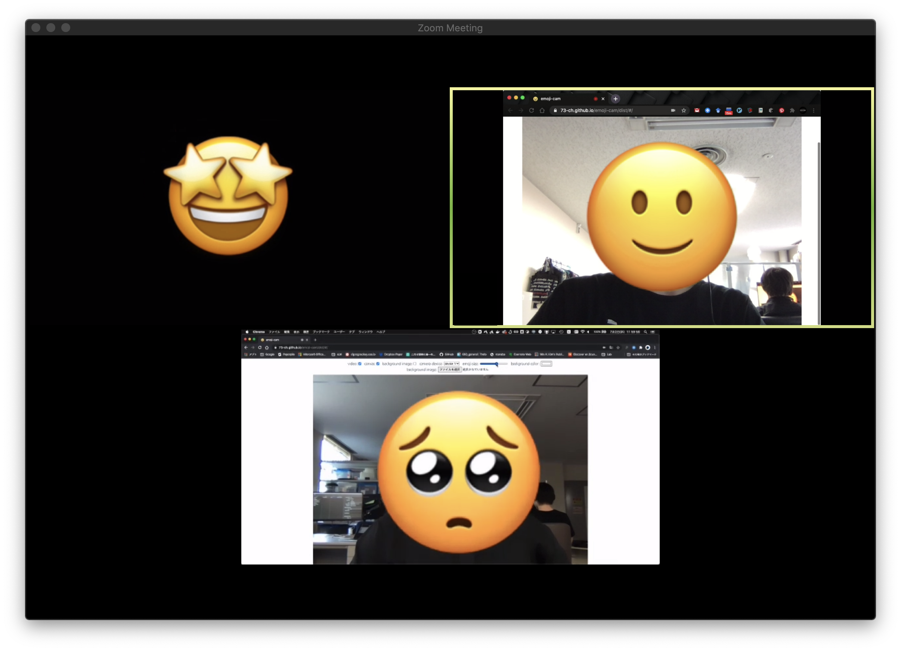

# emoji-cam
This is a video chat tool that lets you put an emoji mask on your face. This tool works on browsers.

このツールは表情に応じた絵文字のマスクをかけるブラウザ上で動作するツールです.

## Concept
The demand for video conferencing has skyrocketed due to the increase in remote work with COVID19. However, video conferencing involves a lot of fatigue from having to keep the camera on all the time, and It is difficult to understand the response of the other person.

COVID19によるリモートワークの増加によって，ビデオ会議の需要が急増しています．しかし，ビデオ会議にはずっとカメラをオンにしておかなければいけない事による疲労の増加や相手の反応がわかりにくいなどの問題があります．

This tool simplifies communication in video conferencing by displaying pictograms based on facial expression analysis, instead of continuously displaying camera images for a long time.

このツールはビデオ会議でカメラ画像を長時間表示し続ける代わりに，表情分析を行なった結果の絵文字を表示することで，コミュニケーションの簡易化を行うツールです．

## How to use
ブラウザ(Chrome, Firefoxを推奨)で [https://73-ch.github.io/emoji-cam/dist/#/](https://73-ch.github.io/emoji-cam/dist/#/) を開き，カメラ入力を選択してください．
ブラウザの画面を画面共有することでテレビ会議に使用することができます．出力をZoomなどのビデオ通話アプリのカメラ入力に使用するには，OBS Virtual InputやNDI Tools, CamTwistなどのアプリケーションを使用ください．
カメラ入力の詳しい方法については [How To Setup VirtualCam](https://github.com/73-ch/emoji-cam/wiki/How-To-Setup-VirtualCam) を見てください．

In your browser (Chrome, Firefox recommended) [https://73-ch. github.io/emoji-cam/dist/#/](https://73-ch.github.io/emoji-cam/dist/#/) and select the camera input.
You can use it for video conferencing by sharing the screen of the browser. To use the output as camera input for video calling apps like Zoom, use OBS Virtual Use Input, NDI Tools, CamTwist or other applications.
For detailed instructions on how to input the camera, see [How To Setup VirtualCam](https://github.com/73-ch/emoji-cam/wiki/How-To-Setup-VirtualCam).

## Examples



### Movie
https://youtu.be/N53lCmZnxRM

## Development / 開発方法
```
yarn install
```

### Compiles and hot-reloads for development
```
yarn serve
```

### Compiles and minifies for production
```
yarn build
```

### Lints and fixes files
```
yarn lint
```

### Acknowledgement / 謝辞
Ippei Suzuki ([https://1heisuzuki.com/](https://1heisuzuki.com/))

DigitalNatureGroup Laboratory ([https://digitalnature.slis.tsukuba.ac.jp/](https://digitalnature.slis.tsukuba.ac.jp/))

### References / 参考文献
- [1heisuzuki/speech-to-text-webcam-overlay](https://github.com/1heisuzuki/speech-to-text-webcam-overlay)
- [justadudewhohacks/face-api.js](https://github.com/justadudewhohacks/face-api.js/)
